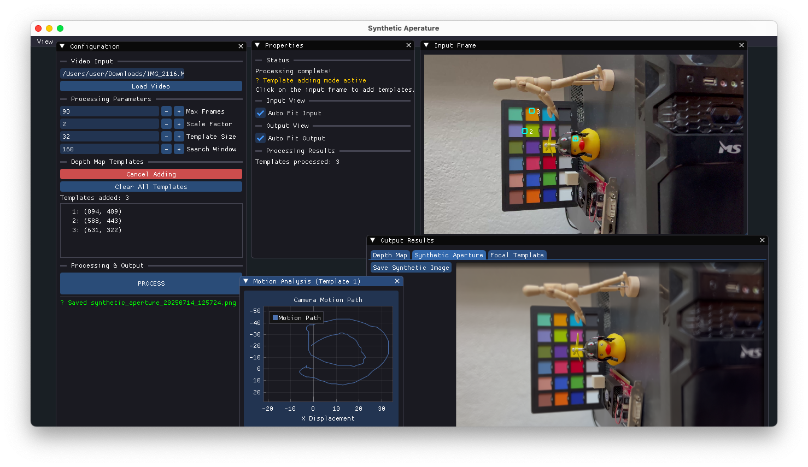
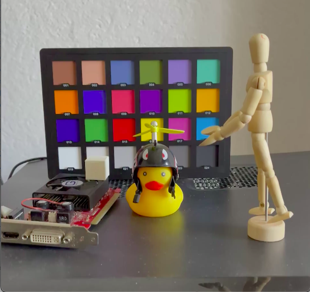
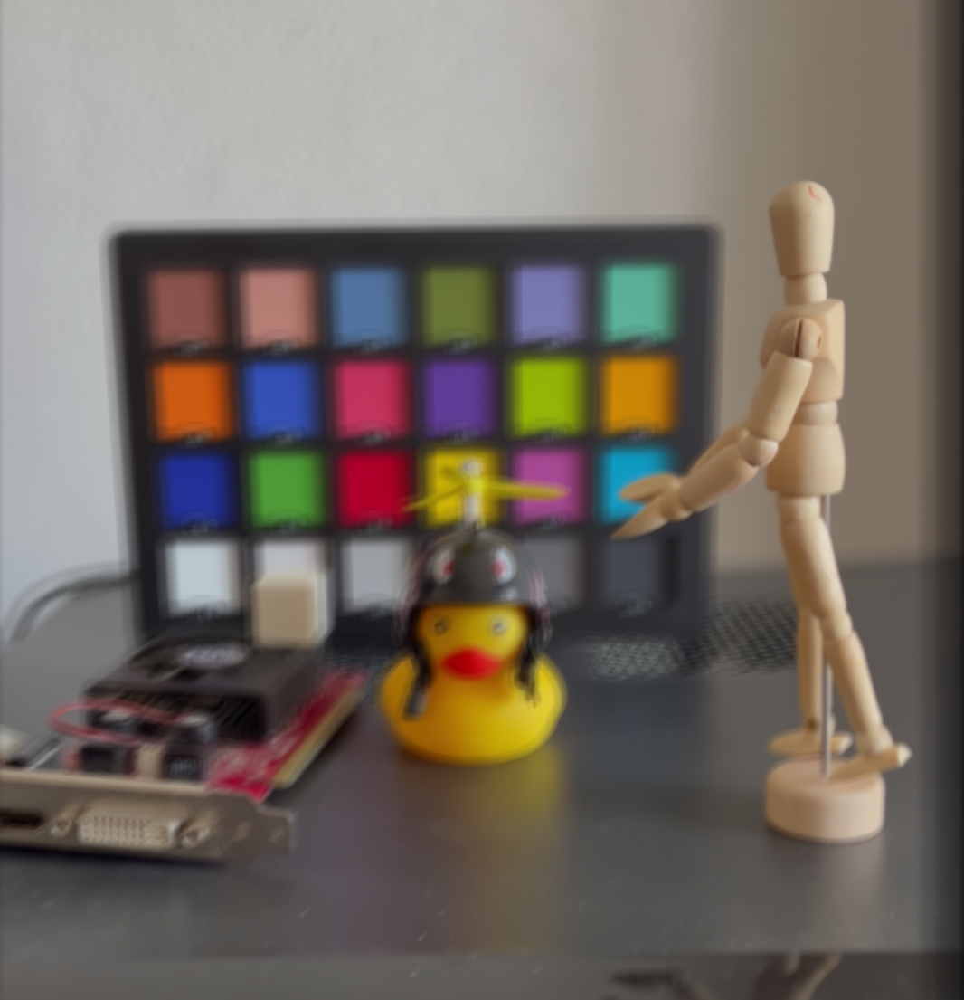
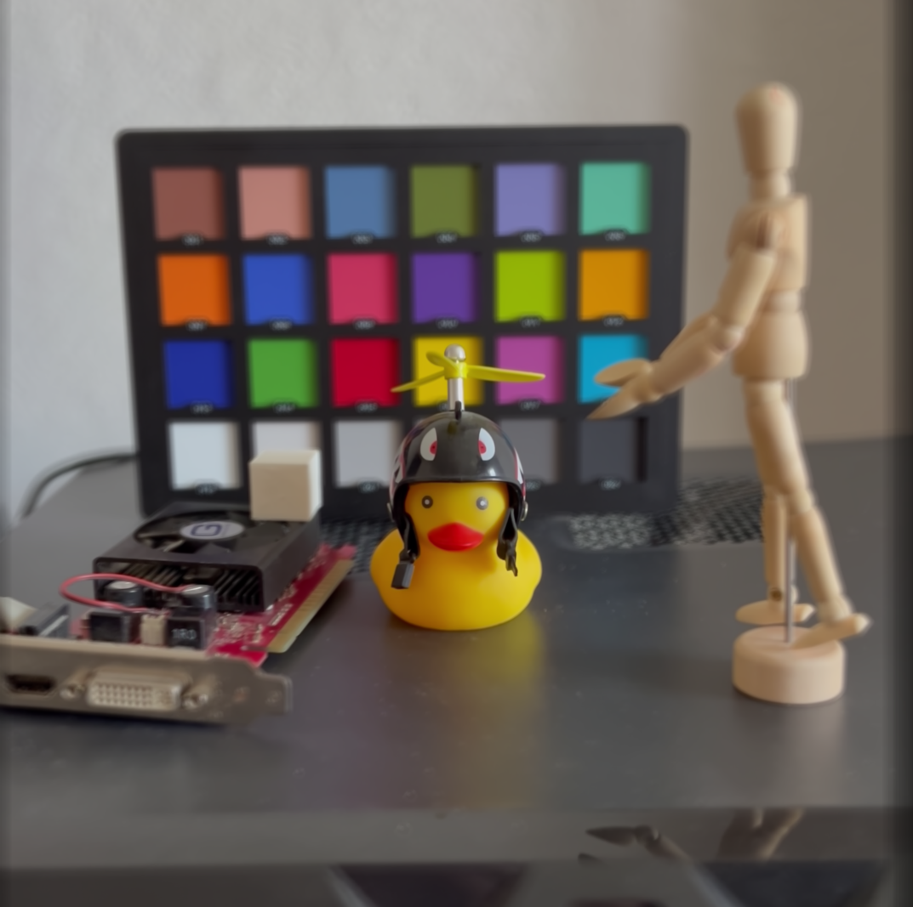
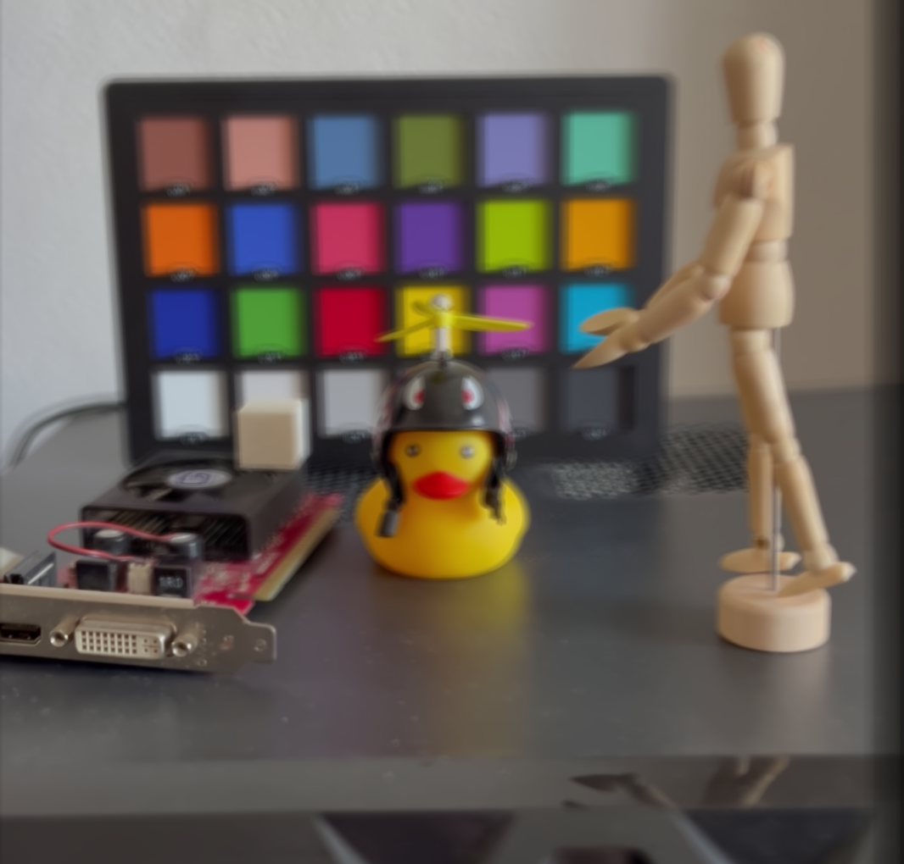

# Synthetic Aperature

## Original without the effect

## Template: Mannequin Focus

## Template: Duck Focus

## Template: GPU Focus 

## How does it work? 

This project uses Unstructured Light Fields to simulate depth of field

1. You pick 2 templates (first template with the subject at focus, the 2nd will be the background).
2. Process
3. Result should be a depth map of the 2 templates as well as the applied blur.

## Why?
We all know that smartphone sensors are small in area size, 
so its implied that they have small opening (aperature), wll this results in images that are sharp but sadly the so called "bokeh" effect seen on professional dslrs is not present, because dslrs have big sensors and big openings in their optics they have that blury bokeh background as seen in portraits and shallow depth of field.

This gives focus on the subject as well as feeling of depth.

# References:
- [Unstructured Light Fields](https://people.csail.mit.edu/abedavis/ULF/).
- [Confocal Imaging](https://graphics.stanford.edu/papers/confocal/)
